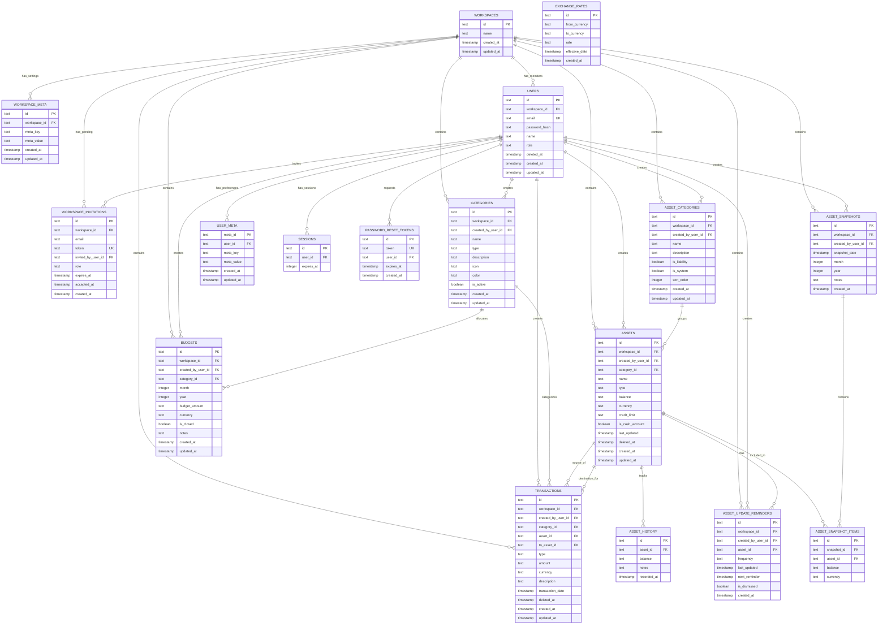

# Database Schema Architecture

This document describes the database schema design for the personal finance application. We use **Drizzle ORM** with **SQLite** (development) and **PostgreSQL/Supabase** (production) with a focus on data integrity, precision, and multi-tenancy.

## Core Principles

1. **Workspace Isolation**: All financial data is scoped to workspaces via `workspace_id` foreign key with cascade delete
2. **User Attribution**: All records track the creator via `created_by_user_id` for audit purposes
3. **Decimal Precision**: Money amounts stored as strings to prevent floating-point errors
4. **Soft Deletes**: Transactional data uses `deleted_at` for audit trail
5. **Timestamp Consistency**: All tables use Unix timestamps (milliseconds since epoch)
6. **Type Safety**: Enums defined at schema level for consistent data validation

## Multi-Tenant Architecture

The application uses a **workspace-centric** multi-tenant model:

- **Workspace** = Shared financial context (personal, family, or team)
- **Users** belong to a single workspace with role-based access (`admin` | `member`)
- **All financial data** is scoped to the workspace, not individual users
- **User attribution** tracks who created each record for audit purposes

```
┌─────────────────────────────────────────────────────────────────────────┐
│                     MULTI-TENANT HIERARCHY                              │
├─────────────────────────────────────────────────────────────────────────┤
│                                                                         │
│   ┌───────────────┐                                                     │
│   │  WORKSPACE    │◀──── Shared financial context                      │
│   └───────┬───────┘                                                     │
│           │                                                             │
│           │ One workspace has many...                                   │
│           │                                                             │
│   ┌───────┴───────────────────────────────────────────────────────┐    │
│   │                                                               │    │
│   │   USERS (admin/member)                                        │    │
│   │   CATEGORIES, ASSETS, TRANSACTIONS, BUDGETS, etc.            │    │
│   │   All scoped by workspace_id                                  │    │
│   │                                                               │    │
│   └───────────────────────────────────────────────────────────────┘    │
│                                                                         │
└─────────────────────────────────────────────────────────────────────────┘
```

## Schema Overview

```
┌─────────────────────────────────────────────────────────────────────────────┐
│                           DATABASE SCHEMA                                    │
├─────────────────────────────────────────────────────────────────────────────┤
│                                                                              │
│  ┌──────────────────┐                                                       │
│  │   WORKSPACES     │◀─────── Root entity for multi-tenancy                │
│  └────────┬─────────┘                                                       │
│           │                                                                  │
│           ├──────────────────────────────────────────────────────────┐      │
│           │                                                          │      │
│  ┌────────▼────────┐    ┌──────────────────┐                        │      │
│  │ WORKSPACE_META  │    │ WORKSPACE_       │                        │      │
│  │ (key-value      │    │ INVITATIONS      │                        │      │
│  │  settings)      │    │ (pending joins)  │                        │      │
│  └─────────────────┘    └──────────────────┘                        │      │
│                                                                      │      │
│  ┌──────────────────┐   ┌──────────────────┐                        │      │
│  │   USERS          │◀──│  USER_META       │  (user prefs)          │      │
│  │ (workspace_id,   │   │                  │                        │      │
│  │  role, deleted_at│   └──────────────────┘                        │      │
│  └────────┬─────────┘                                               │      │
│           │                                                          │      │
│           │ All financial data scoped by workspace_id               │      │
│           │ and tracks created_by_user_id                           │      │
│           │                                                          │      │
│  ┌────────┴────────────────────────────────────────────────────┐    │      │
│  │                                                              │    │      │
│  │   ┌──────────────────┐    ┌──────────────────┐              │    │      │
│  │   │ CATEGORIES       │    │ BUDGETS          │◀─────────────┤    │      │
│  │   │ (workspace_id,   │    │ (workspace_id,   │              │    │      │
│  │   │  created_by_     │    │  created_by_     │              │    │      │
│  │   │  user_id)        │    │  user_id)        │              │    │      │
│  │   └────────┬─────────┘    └────────┬─────────┘              │    │      │
│  │            │                       │                         │    │      │
│  │            └───────┬───────────────┘                         │    │      │
│  │                    │                                         │    │      │
│  │            ┌───────▼────────┐                                │    │      │
│  │            │ TRANSACTIONS   │                                │    │      │
│  │            │ (workspace_id, │                                │    │      │
│  │            │  created_by_   │                                │    │      │
│  │            │  user_id)      │                                │    │      │
│  │            └───────┬────────┘                                │    │      │
│  │                    │                                         │    │      │
│  │   ┌──────────────────┐    ┌───────────────────────┐         │    │      │
│  │   │ ASSET_CATEGORIES │───▶│ ASSETS & LIABILITIES │         │    │      │
│  │   │ (workspace_id,   │    │ (workspace_id,       │         │    │      │
│  │   │  created_by_     │    │  created_by_user_id) │         │    │      │
│  │   │  user_id)        │    │                       │         │    │      │
│  │   └──────────────────┘    └────┬─────┬───────────┘         │    │      │
│  │                                │     │                       │    │      │
│  │   ┌────────────────────────────▼─────▼──────────┐           │    │      │
│  │   │ ASSET_HISTORY                               │           │    │      │
│  │   └─────────────────────────────────────────────┘           │    │      │
│  │                                                              │    │      │
│  │   ┌──────────────────────────────────────────────┐          │    │      │
│  │   │ ASSET_UPDATE_REMINDERS (workspace_id,        │          │    │      │
│  │   │                         created_by_user_id)  │          │    │      │
│  │   └──────────────────────────────────────────────┘          │    │      │
│  │                                                              │    │      │
│  │   ┌──────────────────┐                                      │    │      │
│  │   │ ASSET_SNAPSHOTS  │ (workspace_id, created_by_user_id)   │    │      │
│  │   └────────┬─────────┘                                      │    │      │
│  │            │                                                 │    │      │
│  │   ┌────────▼──────────┐                                     │    │      │
│  │   │ ASSET_SNAPSHOT    │─────────────────────────────────────┘    │      │
│  │   │ _ITEMS            │         (links to ASSETS)                │      │
│  │   └───────────────────┘                                          │      │
│  │                                                                   │      │
│  └───────────────────────────────────────────────────────────────────┘      │
│                                                                              │
│  ┌──────────────────┐                                                       │
│  │ SESSIONS         │  (user_id → users.id)                                │
│  └──────────────────┘                                                       │
│                                                                              │
│  ┌──────────────────┐                                                       │
│  │ PASSWORD_RESET   │  (user_id → users.id)                                │
│  │ _TOKENS          │                                                       │
│  └──────────────────┘                                                       │
│                                                                              │
│  ┌──────────────────┐                                                       │
│  │ EXCHANGE_RATES   │  (no workspace relation - shared data)               │
│  └──────────────────┘                                                       │
│                                                                              │
└─────────────────────────────────────────────────────────────────────────────┘
```

## Entity Relationship Diagram



## Domain Organization

### Workspace Management

#### `workspaces`

Root entity for multi-tenant data isolation. All financial data belongs to a workspace.

- **Primary Key**: `id` (text)
- **Key Fields**:
  - `name`: Workspace display name (e.g., "Personal", "Family Budget")
- **Cascade Deletes**: All workspace-owned data deleted on workspace removal
- **Use Case**: Groups users and financial data into shared contexts

#### `workspace_meta`

Flexible key-value storage for workspace settings (currency preferences, display options, etc.).

- **Primary Key**: `id` (text)
- **Foreign Keys**: `workspace_id` → `workspaces.id` (cascade delete)
- **Key Fields**:
  - `meta_key`: Setting key (e.g., 'currency', 'weekStart', 'compactNumbers')
  - `meta_value`: Setting value (JSON string or simple value)
- **Unique Constraint**: (`workspace_id`, `meta_key`)
- **Common Settings**:
  - `currency`: Default currency ('IDR' | 'USD')
  - `weekStart`: Week start day ('sunday' | 'monday')
  - `compactNumbers`: Whether to show compact numbers (boolean as string)

#### `workspace_invitations`

Pending invitations for users to join a workspace.

- **Primary Key**: `id` (text)
- **Unique Constraints**: `token`
- **Foreign Keys**:
  - `workspace_id` → `workspaces.id` (cascade delete)
  - `invited_by_user_id` → `users.id` (nullable, for system-generated invites)
- **Key Fields**:
  - `email`: Email address of invitee
  - `token`: Unique invitation token (for secure joining)
  - `role`: Assigned role on acceptance ('admin' | 'member')
  - `expires_at`: Invitation expiration timestamp
  - `accepted_at`: When invitation was accepted (NULL if pending)
- **TTL**: Invitations typically expire after 7 days
- **Use Case**: Enables workspace admins to invite new members

### Authentication & User Management

#### `users`

User accounts belonging to a workspace with role-based access.

- **Primary Key**: `id` (text)
- **Unique Constraints**: `email` (globally unique)
- **Foreign Keys**: `workspace_id` → `workspaces.id` (cascade delete)
- **Key Fields**:
  - `workspace_id`: The workspace this user belongs to
  - `email`: User's email address (unique login identifier)
  - `password_hash`: Bcrypt hashed password
  - `name`: Display name
  - `role`: User role within workspace ('admin' | 'member')
  - `deleted_at`: Soft delete timestamp (for member removal without data loss)
- **Roles**:
  - `admin`: Can manage workspace settings, invite/remove members
  - `member`: Can view and create financial data
- **Soft Delete**: Removed members have `deleted_at` set (preserves audit trail)

#### `sessions`

Lucia Auth session storage.

- **Primary Key**: `id` (text)
- **Foreign Keys**: `user_id` → `users.id` (cascade delete)
- **Indexes**: `expires_at` for efficient cleanup
- **Notes**: Column names use camelCase for Lucia adapter compatibility

#### `password_reset_tokens`

Secure password reset functionality.

- **Primary Key**: `id` (text)
- **Unique Constraints**: `token`
- **Foreign Keys**: `user_id` → `users.id` (cascade delete)
- **Indexes**: `token`, `user_id`, `expires_at`
- **TTL**: Tokens expire after 1 hour

#### `user_meta`

Flexible key-value storage for user preferences and settings (personal to each user, not workspace-wide).

- **Primary Key**: `meta_id` (text)
- **Foreign Keys**: `user_id` → `users.id` (cascade delete)
- **Key Fields**:
  - `meta_key`: Setting key (validated against allowlist at service layer)
  - `meta_value`: Setting value (limited to 4KB at service layer)
- **Unique Constraint**: (`user_id`, `meta_key`)
- **Indexes**: `user_id`
- **Security Notes**:
  - `meta_key` must be validated against an allowlist at the service layer
  - `meta_value` is limited to 4KB at the service layer
  - Users can only access their own meta (enforced via `user_id`)

### Financial Transactions

#### `categories`

Income and expense categories for transaction organization. Shared across the workspace.

- **Primary Key**: `id` (text)
- **Foreign Keys**:
  - `workspace_id` → `workspaces.id` (cascade delete)
  - `created_by_user_id` → `users.id` (audit trail)
- **Key Fields**:
  - `workspace_id`: Workspace this category belongs to
  - `created_by_user_id`: User who created this category
  - `name`: Category name
  - `type`: 'expense' | 'income'
  - `description`: Optional description (max 200 chars)
  - `icon`: Lucide icon name (default: 'tag')
  - `color`: DaisyUI semantic color class (default: 'bg-neutral')
  - `is_active`: Soft enable/disable
- **Validation**: All workspace members can see/use categories
- **Note**: Budget amounts are defined in the `budgets` table per-period

#### `budgets`

Period-specific budget allocations for categories. Shared across the workspace.

- **Primary Key**: `id` (text)
- **Foreign Keys**:
  - `workspace_id` → `workspaces.id` (cascade delete)
  - `created_by_user_id` → `users.id` (audit trail)
  - `category_id` → `categories.id` (cascade delete)
- **Key Fields**:
  - `workspace_id`: Workspace this budget belongs to
  - `created_by_user_id`: User who created this budget
  - `month`: Month (1-12)
  - `year`: Year (YYYY)
  - `budget_amount`: Budget limit for this period (string for precision)
  - `currency`: IDR | USD
  - `is_closed`: Whether this budget period is closed (for book closing)
  - `notes`: Optional notes for this budget period
- **Unique Constraint**: (workspace_id, category_id, month, year)
- **Use Case**: Allow flexible, period-specific budgeting overrides

#### `transactions`

Financial transactions (income/expenses/transfers). Shared across the workspace.

- **Primary Key**: `id` (text)
- **Foreign Keys**:
  - `workspace_id` → `workspaces.id` (cascade delete)
  - `created_by_user_id` → `users.id` (audit trail)
  - `category_id` → `categories.id` (nullable for transfers)
  - `asset_id` → `assets.id` (source asset)
  - `to_asset_id` → `assets.id` (destination asset for transfers)
- **Key Fields**:
  - `workspace_id`: Workspace this transaction belongs to
  - `created_by_user_id`: User who created this transaction
  - `type`: 'expense' | 'income' | 'transfer'
  - `amount`: Transaction amount (string for precision)
  - `currency`: IDR | USD
  - `description`: Optional notes
  - `transaction_date`: When transaction occurred
  - `deleted_at`: Soft delete timestamp (for audit trail)
- **Soft Delete**: Uses `deleted_at` to maintain history
- **Transfer Handling**: For transfers, `category_id` is null, `asset_id` is the source, and `to_asset_id` is the destination

### Asset & Liability Tracking

#### `asset_categories`

Workspace-defined categories for organizing assets and liabilities.

- **Primary Key**: `id` (text)
- **Foreign Keys**:
  - `workspace_id` → `workspaces.id` (cascade delete)
  - `created_by_user_id` → `users.id` (audit trail)
- **Key Fields**:
  - `workspace_id`: Workspace this category belongs to
  - `created_by_user_id`: User who created this category
  - `name`: Category name (e.g., "Investments", "Emergency Fund", "Retirement")
  - `description`: Optional description
  - `is_liability`: Whether this category is for liabilities (vs assets)
  - `is_system`: Whether this is a system-created default category (cannot be deleted)
  - `sort_order`: Display order for sorting categories
- **Use Case**: Allows workspace members to create custom groupings for their assets/liabilities beyond the built-in types

#### `assets`

Accounts representing both assets (what you own) and liabilities (what you owe). Shared across the workspace.

- **Primary Key**: `id` (text)
- **Foreign Keys**:
  - `workspace_id` → `workspaces.id` (cascade delete)
  - `created_by_user_id` → `users.id` (audit trail)
  - `category_id` → `asset_categories.id` (nullable, for custom grouping)
- **Key Fields**:
  - `workspace_id`: Workspace this asset belongs to
  - `created_by_user_id`: User who created this asset
  - `type`: Asset type ('cash', 'bank_account', 'e_wallet', 'mutual_fund', 'bond', 'crypto', 'stock', 'other') or Liability type ('credit_card', 'loan')
  - `balance`: Current value (positive for assets, positive for liabilities - represents amount owed) (string for precision)
  - `currency`: IDR | USD
  - `credit_limit`: For credit cards only, the maximum credit limit (string for precision)
  - `is_cash_account`: Flag for cash-type accounts (used for liquidity calculations)
  - `last_updated`: Last balance update timestamp
  - `deleted_at`: Soft delete timestamp
- **Soft Delete**: Preserves historical data
- **Asset Types**: cash, bank_account, e_wallet, mutual_fund, bond, crypto, stock, other
- **Liability Types**: credit_card, loan

#### `asset_history`

Balance change log for assets.

- **Primary Key**: `id` (text)
- **Foreign Keys**: `asset_id` → `assets.id` (cascade delete)
- **Key Fields**:
  - `balance`: Balance at this point in time (string for precision)
  - `notes`: Optional update notes
  - `recorded_at`: When this balance was recorded
- **Use Case**: Track asset performance over time

#### `asset_update_reminders`

Scheduled reminders to update asset balances. Shared across the workspace.

- **Primary Key**: `id` (text)
- **Foreign Keys**:
  - `workspace_id` → `workspaces.id` (cascade delete)
  - `created_by_user_id` → `users.id` (audit trail)
  - `asset_id` → `assets.id` (cascade delete)
- **Key Fields**:
  - `workspace_id`: Workspace this reminder belongs to
  - `created_by_user_id`: User who created this reminder
  - `frequency`: 'weekly' | 'monthly' | 'quarterly'
  - `last_updated`: Last time asset was updated
  - `next_reminder`: When to show next reminder
  - `is_dismissed`: User dismissed this reminder
- **Use Case**: Prompt workspace members to keep asset values current

#### `asset_snapshots`

Monthly net worth snapshots. Shared across the workspace.

- **Primary Key**: `id` (text)
- **Foreign Keys**:
  - `workspace_id` → `workspaces.id` (cascade delete)
  - `created_by_user_id` → `users.id` (audit trail)
- **Key Fields**:
  - `workspace_id`: Workspace this snapshot belongs to
  - `created_by_user_id`: User who created this snapshot
  - `snapshot_date`: Date of snapshot capture
  - `month`: Month (1-12)
  - `year`: Year (YYYY)
  - `notes`: Optional snapshot notes
- **Use Case**: Monthly net worth reports and trends

#### `asset_snapshot_items`

Individual asset values within a snapshot.

- **Primary Key**: `id` (text)
- **Foreign Keys**:
  - `snapshot_id` → `asset_snapshots.id` (cascade delete)
  - `asset_id` → `assets.id`
- **Key Fields**:
  - `balance`: Asset value at snapshot time (string for precision)
  - `currency`: IDR | USD
- **Use Case**: Detailed breakdown of monthly net worth

### Reference Data

#### `exchange_rates`

Currency conversion rates (global, not per-user).

- **Primary Key**: `id` (text)
- **Key Fields**:
  - `from_currency`: IDR | USD
  - `to_currency`: IDR | USD
  - `rate`: Conversion rate (string for precision)
  - `effective_date`: When this rate became effective
- **No User Relation**: Shared across all users
- **Use Case**: Currency conversion for multi-currency support

## Data Type Conventions

### Money Amounts

**Always stored as text (strings) for decimal precision.**

```typescript
// ✅ Correct
amount: text('amount').notNull(); // "123.45"

// ❌ Wrong - floating point errors
amount: real('amount').notNull(); // 123.44999999
```

**Rationale**: Prevents floating-point arithmetic errors in financial calculations. Convert to `Decimal` or `BigInt` in application layer.

### Timestamps

**Unix timestamps in milliseconds (integer).**

```typescript
created_at: integer('created_at', { mode: 'timestamp' }).default(sqliteTimestampNow).notNull();
```

**Helper**: `sqliteTimestampNow` converts Julian date to Unix epoch:

```typescript
// (Julian Day - 2440587.5) * 86400000
const sqliteTimestampNow = sql`(cast((julianday('now') - 2440587.5)*86400000 as integer))`;
```

### Enums

**Defined at schema level for type safety.**

```typescript
type: text('type', { enum: ['expense', 'income'] }).notNull();
currency: text('currency', { enum: ['IDR', 'USD'] }).notNull();
```

### Booleans

**Use integer mode for cross-database compatibility.**

```typescript
is_active: integer('is_active', { mode: 'boolean' }).default(true).notNull();
```

## Schema Patterns

### Workspace Data Isolation

All workspace-owned tables include cascade delete:

```typescript
workspace_id: text('workspace_id')
  .notNull()
  .references(() => workspaces.id, { onDelete: 'cascade' });
```

When a workspace is deleted, all its data is automatically removed (users, categories, transactions, etc.).

### User Attribution (Audit Trail)

All financial tables track who created each record:

```typescript
created_by_user_id: text('created_by_user_id')
  .notNull()
  .references(() => users.id);
```

This enables:

- Audit trail for who created each record
- Filtering by creator if needed
- No cascade delete (records persist even if creator is soft-deleted)

### Soft Deletes

Transactional tables use `deleted_at` for audit trail:

```typescript
deleted_at: integer('deleted_at', { mode: 'timestamp' });
```

- `NULL` = active record
- `timestamp` = soft deleted (hidden from queries)

### Active/Inactive Flags

Configuration tables use `is_active` for enable/disable:

```typescript
is_active: integer('is_active', { mode: 'boolean' }).default(true).notNull();
```

Allows users to temporarily disable categories without deletion.

### Audit Timestamps

All tables include creation and update tracking:

```typescript
created_at: integer('created_at', { mode: 'timestamp' })
  .default(sqliteTimestampNow)
  .notNull(),
updated_at: integer('updated_at', { mode: 'timestamp' })
  .default(sqliteTimestampNow)
  .notNull()
```

Application layer must update `updated_at` on modifications.

## Indexes

### Current Indexes

```typescript
// sessions - efficient session cleanup
index('sessions_expires_at_idx').on(table.expiresAt);

// password_reset_tokens - lookup optimization
index('password_reset_tokens_token_idx').on(table.token);
index('password_reset_tokens_user_id_idx').on(table.user_id);
index('password_reset_tokens_expires_at_idx').on(table.expires_at);
```

### Future Index Considerations

As data grows, consider adding:

- `transactions(user_id, transaction_date)` - for dashboard queries
- `transactions(category_id)` - for category reports
- `assets(user_id, deleted_at)` - for asset list filtering
- `asset_history(asset_id, recorded_at)` - for performance charts

## Multi-Currency Support

### Currency Fields

Two currencies supported: `IDR` (Indonesian Rupiah) and `USD` (US Dollar).

### Storage Strategy

1. **Native Currency**: Store amounts in their original currency
2. **User Preference**: User's primary currency stored in `user_meta` for display
3. **Conversion**: Use `exchange_rates` for real-time conversion
4. **Display Options**:
   - Show converted totals only
   - Show individual currency breakdowns
   - Show both

### Example Query Pattern

```typescript
// Fetch transactions with conversion
const txns = await db.query.transactions.findMany({
  where: eq(transactions.user_id, userId),
  with: {
    category: true,
    asset: true,
    toAsset: true,
  },
});

// Convert to primary currency
const rates = await getExchangeRates();
const converted = txns.map((txn) => ({
  ...txn,
  convertedAmount: convertCurrency(txn.amount, txn.currency, user.settings.primary_currency, rates),
}));
```

## Migration Strategy

### File Structure

```
drizzle/
├── 0000_hard_silk_fever.sql      # Initial schema
├── 0001_watery_celestials.sql    # Asset tracking
└── 0002_material_sentinel.sql    # Latest changes
```

### Migration Commands

```bash
# Generate migration from schema changes
bun run db:generate

# Apply migrations
bun run db:migrate

# Push schema directly (dev only)
bun run db:push
```

### Best Practices

1. **Never Edit Migration Files**: Always generate new ones
2. **Test Rollbacks**: Ensure data can be safely reverted
3. **Backup Production**: Before applying migrations
4. **Run in Transaction**: Use `BEGIN/COMMIT` for atomicity

## Data Integrity Rules

### Referential Integrity

- All foreign keys use `references()` with `onDelete` actions
- Cascade deletes for user data (automatic cleanup)
- No cascade for reference data (prevent accidental deletion)

### Validation

- Enum types at schema level (database constraint)
- Not-null constraints where applicable
- Unique constraints for business keys (email, token)

### Consistency

- Currency must match between related records (e.g., category and transaction)
- Soft-deleted records excluded from active queries
- Timestamps always in UTC (via Unix epoch)

## Query Patterns

### Workspace Data Scoping

Always filter by `workspace_id`:

```typescript
// ✅ Correct - scoped to workspace
const categories = await db.query.categories.findMany({
  where: eq(categories.workspace_id, workspaceId),
});

// ❌ Wrong - exposes all workspaces' data
const categories = await db.query.categories.findMany();
```

### Soft Delete Filtering

Exclude deleted records:

```typescript
// Active transactions only
where: and(eq(transactions.workspace_id, workspaceId), isNull(transactions.deleted_at));

// Active users only (not removed from workspace)
where: and(eq(users.workspace_id, workspaceId), isNull(users.deleted_at));
```

### With Relations

Use Drizzle's relational queries for joins:

```typescript
const txns = await db.query.transactions.findMany({
  where: eq(transactions.workspace_id, workspaceId),
  with: {
    category: true,
    asset: true,
    toAsset: true,
    createdBy: true, // User who created this transaction
  },
});
```

### Filtering by Creator

When needed, filter by who created the record:

```typescript
// Get transactions created by a specific user (within their workspace)
const myTxns = await db.query.transactions.findMany({
  where: and(
    eq(transactions.workspace_id, workspaceId),
    eq(transactions.created_by_user_id, userId),
    isNull(transactions.deleted_at)
  ),
});
```

## Schema Location

The schema is organized by database type (SQLite for development, PostgreSQL for production):

```
src/db/schema/
├── index.ts                      # Export all schemas (auto-selects based on env)
├── sqlite/                       # SQLite schema (development)
│   ├── index.ts                  # Export all SQLite tables
│   ├── base.ts                   # Common utilities (timestamps)
│   ├── relations.ts              # Drizzle ORM relations
│   ├── workspaces.ts             # Workspace (tenant) definition
│   ├── workspace-meta.ts         # Workspace settings (key-value)
│   ├── workspace-invitations.ts  # Pending workspace invitations
│   ├── users.ts                  # User accounts (with workspace_id, role)
│   ├── user-meta.ts              # User preferences (key-value)
│   ├── sessions.ts               # Authentication sessions
│   ├── password-reset-tokens.ts  # Password reset
│   ├── categories.ts             # Income/expense categories
│   ├── asset-categories.ts       # Custom asset categories
│   ├── budgets.ts                # Period-specific budget allocations
│   ├── transactions.ts           # Financial transactions
│   ├── assets.ts                 # Assets & liabilities
│   ├── asset-history.ts          # Balance tracking
│   ├── asset-update-reminders.ts # Update notifications
│   ├── asset-snapshots.ts        # Monthly net worth
│   ├── asset-snapshot-items.ts   # Snapshot details
│   ├── audit-logs.ts             # Audit trail
│   └── exchange-rates.ts         # Currency conversion
└── postgresql/                   # PostgreSQL schema (production)
    └── ... (mirrors sqlite structure)
```

## Key Takeaways

1. **Workspace Isolation**: All financial data isolated by `workspace_id` with cascade deletes
2. **User Attribution**: All records track `created_by_user_id` for audit trail
3. **Role-Based Access**: Users have `admin` or `member` role within their workspace
4. **Decimal Precision**: Money stored as strings to prevent floating-point errors
5. **Soft Deletes**: Transactions, assets, and users use `deleted_at` for audit trail
6. **Multi-Currency**: Native currency storage with conversion at query time
7. **Type Safety**: Drizzle schema provides end-to-end TypeScript types
8. **Modular Organization**: One file per table for maintainability

## Related Documentation

- `src/db/schema/` - Schema definitions
- `drizzle/` - Migration files
- `src/db/index.ts` - Database client setup
- `docs/constitution.md` - Development principles
