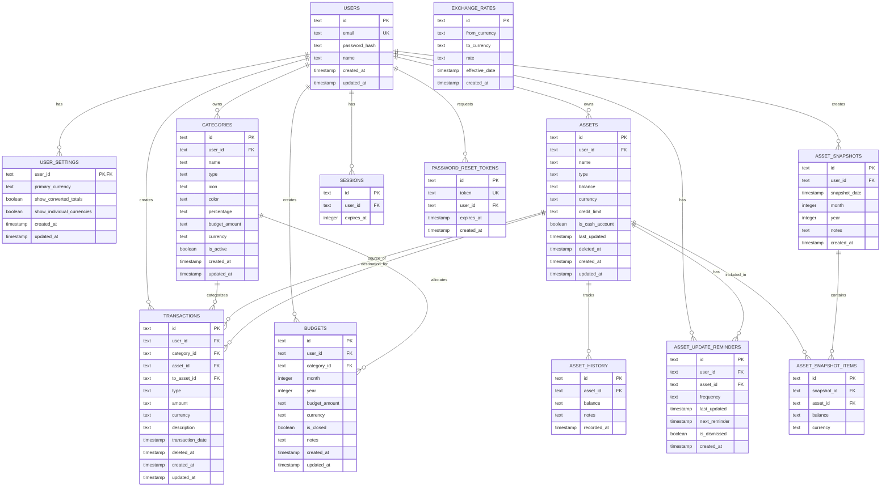

# Database Schema Architecture

This document describes the database schema design for the personal finance application. We use **Drizzle ORM** with **SQLite** (development) and **PostgreSQL/Supabase** (production) with a focus on data integrity, precision, and multi-tenancy.

## Core Principles

1. **User Isolation**: All user data tables include `user_id` foreign key with cascade delete
2. **Decimal Precision**: Money amounts stored as strings to prevent floating-point errors
3. **Soft Deletes**: Transactional data uses `deleted_at` for audit trail
4. **Timestamp Consistency**: All tables use Unix timestamps (milliseconds since epoch)
5. **Type Safety**: Enums defined at schema level for consistent data validation

## Schema Overview

```
┌─────────────────────────────────────────────────────────────────────┐
│                         DATABASE SCHEMA                             │
├─────────────────────────────────────────────────────────────────────┤
│                                                                     │
│  ┌──────────────┐        ┌──────────────────┐                      │
│  │   USERS      │◀───────│  USER_SETTINGS   │                      │
│  │              │        │                  │                      │
│  └──────┬───────┘        └──────────────────┘                      │
│         │                                                           │
│         │ Cascade Delete                                           │
│         │                                                           │
│  ┌──────┴─────────────────────────────────────────────┐            │
│  │                                                     │            │
│  │   ┌──────────────────┐    ┌──────────────────┐    │            │
│  ├──▶│ CATEGORIES       │    │ BUDGETS          │◀───┤            │
│  │   └────────┬─────────┘    └────────┬─────────┘    │            │
│  │            │                       │               │            │
│  │            └───────┬───────────────┘               │            │
│  │                    │                               │            │
│  │            ┌───────▼────────┐                      │            │
│  │            │ TRANSACTIONS   │                      │            │
│  │            └───────┬────────┘                      │            │
│  │                    │                               │            │
│  │   ┌────────────────▼──────────┐                   │            │
│  ├──▶│ ASSETS & LIABILITIES       │                   │            │
│  │   │ (cash, bank, e-wallet,     │                   │            │
│  │   │  credit_card, loan, etc.)  │                   │            │
│  │   └────┬─────┬─────────────────┘                   │            │
│  │        │     │                                     │            │
│  │   ┌────▼─────▼──────┐    ┌──────────────────────┐ │            │
│  │   │ ASSET_HISTORY   │    │ ASSET_UPDATE         │◀┤            │
│  │   └─────────────────┘    │ _REMINDERS           │ │            │
│  │                          └──────────────────────┘ │            │
│  │                                                     │            │
│  │   ┌──────────────────┐                             │            │
│  ├──▶│ ASSET_SNAPSHOTS  │                             │            │
│  │   └────────┬─────────┘                             │            │
│  │            │                                        │            │
│  │   ┌────────▼──────────┐                            │            │
│  │   │ ASSET_SNAPSHOT    │                            │            │
│  │   │ _ITEMS            │────────────────────────────┘            │
│  │   └───────────────────┘         (links to ASSETS)              │
│  │                                                                 │
│  │   ┌──────────────────┐                                          │
│  ├──▶│ SESSIONS         │                                          │
│  │   └──────────────────┘                                          │
│  │                                                                 │
│  │   ┌──────────────────┐                                          │
│  └──▶│ PASSWORD_RESET   │                                          │
│      │ _TOKENS          │                                          │
│      └──────────────────┘                                          │
│                                                                     │
│  ┌──────────────────┐                                              │
│  │ EXCHANGE_RATES   │  (no user relation - shared data)           │
│  └──────────────────┘                                              │
│                                                                     │
└─────────────────────────────────────────────────────────────────────┘
```

## Entity Relationship Diagram



## Domain Organization

### Authentication & User Management

#### `users`

Core user accounts table.

- **Primary Key**: `id` (text)
- **Unique Constraints**: `email`
- **Key Fields**:
  - `email`: User's email address (unique login identifier)
  - `password_hash`: Bcrypt hashed password
  - `name`: Display name
- **Cascade Deletes**: All user-related data deleted on user removal

#### `sessions`

Lucia Auth session storage.

- **Primary Key**: `id` (text)
- **Foreign Keys**: `user_id` → `users.id` (cascade delete)
- **Indexes**: `expires_at` for efficient cleanup
- **Notes**: Column names use camelCase for Lucia adapter compatibility

#### `password_reset_tokens`

Secure password reset functionality.

- **Primary Key**: `id` (text)
- **Unique Constraints**: `token`
- **Foreign Keys**: `user_id` → `users.id` (cascade delete)
- **Indexes**: `token`, `user_id`, `expires_at`
- **TTL**: Tokens expire after 1 hour

#### `user_settings`

User preferences and display options.

- **Primary Key**: `user_id` (also FK to users)
- **Key Fields**:
  - `primary_currency`: Default currency (IDR/USD)
  - `show_converted_totals`: Toggle total conversions
  - `show_individual_currencies`: Toggle per-currency breakdowns

### Financial Transactions

#### `categories`

Income and expense categories for transaction organization.

- **Primary Key**: `id` (text)
- **Foreign Keys**: `user_id` → `users.id` (cascade delete)
- **Key Fields**:
  - `type`: 'expense' | 'income'
  - `icon`: Lucide icon name (default: 'tag')
  - `color`: DaisyUI semantic color class (default: 'bg-neutral')
  - `percentage`: Budget allocation percentage (string for precision)
  - `budget_amount`: Default monthly budget limit (string for precision)
  - `currency`: IDR | USD
  - `is_active`: Soft enable/disable
- **Validation**: User can only see/use their own categories
- **Note**: Budget amounts can be overridden per-period in the `budgets` table

#### `budgets`

Period-specific budget allocations for categories.

- **Primary Key**: `id` (text)
- **Foreign Keys**:
  - `user_id` → `users.id` (cascade delete)
  - `category_id` → `categories.id` (cascade delete)
- **Key Fields**:
  - `month`: Month (1-12)
  - `year`: Year (YYYY)
  - `budget_amount`: Budget limit for this period (string for precision)
  - `currency`: IDR | USD
  - `is_closed`: Whether this budget period is closed (for book closing)
  - `notes`: Optional notes for this budget period
- **Unique Constraint**: (user_id, category_id, month, year)
- **Use Case**: Allow flexible, period-specific budgeting overrides

#### `transactions`

Financial transactions (income/expenses/transfers).

- **Primary Key**: `id` (text)
- **Foreign Keys**:
  - `user_id` → `users.id` (cascade delete)
  - `category_id` → `categories.id` (nullable for transfers)
  - `asset_id` → `assets.id` (source asset)
  - `to_asset_id` → `assets.id` (destination asset for transfers)
- **Key Fields**:
  - `type`: 'expense' | 'income' | 'transfer'
  - `amount`: Transaction amount (string for precision)
  - `currency`: IDR | USD
  - `description`: Optional notes
  - `transaction_date`: When transaction occurred
  - `deleted_at`: Soft delete timestamp (for audit trail)
- **Soft Delete**: Uses `deleted_at` to maintain history
- **Transfer Handling**: For transfers, `category_id` is null, `asset_id` is the source, and `to_asset_id` is the destination

### Asset & Liability Tracking

#### `assets`

Accounts representing both assets (what you own) and liabilities (what you owe).

- **Primary Key**: `id` (text)
- **Foreign Keys**: `user_id` → `users.id` (cascade delete)
- **Key Fields**:
  - `type`: Asset type ('cash', 'bank_account', 'e_wallet', 'mutual_fund', 'bond', 'crypto', 'stock', 'other') or Liability type ('credit_card', 'loan')
  - `balance`: Current value (positive for assets, positive for liabilities - represents amount owed) (string for precision)
  - `currency`: IDR | USD
  - `credit_limit`: For credit cards only, the maximum credit limit (string for precision)
  - `is_cash_account`: Flag for cash-type accounts (used for liquidity calculations)
  - `last_updated`: Last balance update timestamp
  - `deleted_at`: Soft delete timestamp
- **Soft Delete**: Preserves historical data
- **Asset Types**: cash, bank_account, e_wallet, mutual_fund, bond, crypto, stock, other
- **Liability Types**: credit_card, loan

#### `asset_history`

Balance change log for assets.

- **Primary Key**: `id` (text)
- **Foreign Keys**: `asset_id` → `assets.id` (cascade delete)
- **Key Fields**:
  - `balance`: Balance at this point in time (string for precision)
  - `notes`: Optional update notes
  - `recorded_at`: When this balance was recorded
- **Use Case**: Track asset performance over time

#### `asset_update_reminders`

Scheduled reminders to update asset balances.

- **Primary Key**: `id` (text)
- **Foreign Keys**:
  - `user_id` → `users.id` (cascade delete)
  - `asset_id` → `assets.id` (cascade delete)
- **Key Fields**:
  - `frequency`: 'weekly' | 'monthly' | 'quarterly'
  - `last_updated`: Last time asset was updated
  - `next_reminder`: When to show next reminder
  - `is_dismissed`: User dismissed this reminder
- **Use Case**: Prompt users to keep asset values current

#### `asset_snapshots`

Monthly net worth snapshots.

- **Primary Key**: `id` (text)
- **Foreign Keys**: `user_id` → `users.id` (cascade delete)
- **Key Fields**:
  - `snapshot_date`: Date of snapshot capture
  - `month`: Month (1-12)
  - `year`: Year (YYYY)
  - `notes`: Optional snapshot notes
- **Use Case**: Monthly net worth reports and trends

#### `asset_snapshot_items`

Individual asset values within a snapshot.

- **Primary Key**: `id` (text)
- **Foreign Keys**:
  - `snapshot_id` → `asset_snapshots.id` (cascade delete)
  - `asset_id` → `assets.id`
- **Key Fields**:
  - `balance`: Asset value at snapshot time (string for precision)
  - `currency`: IDR | USD
- **Use Case**: Detailed breakdown of monthly net worth

### Reference Data

#### `exchange_rates`

Currency conversion rates (global, not per-user).

- **Primary Key**: `id` (text)
- **Key Fields**:
  - `from_currency`: IDR | USD
  - `to_currency`: IDR | USD
  - `rate`: Conversion rate (string for precision)
  - `effective_date`: When this rate became effective
- **No User Relation**: Shared across all users
- **Use Case**: Currency conversion for multi-currency support

## Data Type Conventions

### Money Amounts

**Always stored as text (strings) for decimal precision.**

```typescript
// ✅ Correct
amount: text('amount').notNull(); // "123.45"

// ❌ Wrong - floating point errors
amount: real('amount').notNull(); // 123.44999999
```

**Rationale**: Prevents floating-point arithmetic errors in financial calculations. Convert to `Decimal` or `BigInt` in application layer.

### Timestamps

**Unix timestamps in milliseconds (integer).**

```typescript
created_at: integer('created_at', { mode: 'timestamp' }).default(sqliteTimestampNow).notNull();
```

**Helper**: `sqliteTimestampNow` converts Julian date to Unix epoch:

```typescript
// (Julian Day - 2440587.5) * 86400000
const sqliteTimestampNow = sql`(cast((julianday('now') - 2440587.5)*86400000 as integer))`;
```

### Enums

**Defined at schema level for type safety.**

```typescript
type: text('type', { enum: ['expense', 'income'] }).notNull();
currency: text('currency', { enum: ['IDR', 'USD'] }).notNull();
```

### Booleans

**Use integer mode for cross-database compatibility.**

```typescript
is_active: integer('is_active', { mode: 'boolean' }).default(true).notNull();
```

## Schema Patterns

### User Data Isolation

All user-owned tables include cascade delete:

```typescript
user_id: text('user_id')
  .notNull()
  .references(() => users.id, { onDelete: 'cascade' });
```

When a user is deleted, all their data is automatically removed.

### Soft Deletes

Transactional tables use `deleted_at` for audit trail:

```typescript
deleted_at: integer('deleted_at', { mode: 'timestamp' });
```

- `NULL` = active record
- `timestamp` = soft deleted (hidden from queries)

### Active/Inactive Flags

Configuration tables use `is_active` for enable/disable:

```typescript
is_active: integer('is_active', { mode: 'boolean' }).default(true).notNull();
```

Allows users to temporarily disable categories without deletion.

### Audit Timestamps

All tables include creation and update tracking:

```typescript
created_at: integer('created_at', { mode: 'timestamp' })
  .default(sqliteTimestampNow)
  .notNull(),
updated_at: integer('updated_at', { mode: 'timestamp' })
  .default(sqliteTimestampNow)
  .notNull()
```

Application layer must update `updated_at` on modifications.

## Indexes

### Current Indexes

```typescript
// sessions - efficient session cleanup
index('sessions_expires_at_idx').on(table.expiresAt);

// password_reset_tokens - lookup optimization
index('password_reset_tokens_token_idx').on(table.token);
index('password_reset_tokens_user_id_idx').on(table.user_id);
index('password_reset_tokens_expires_at_idx').on(table.expires_at);
```

### Future Index Considerations

As data grows, consider adding:

- `transactions(user_id, transaction_date)` - for dashboard queries
- `transactions(category_id)` - for category reports
- `assets(user_id, deleted_at)` - for asset list filtering
- `asset_history(asset_id, recorded_at)` - for performance charts

## Multi-Currency Support

### Currency Fields

Two currencies supported: `IDR` (Indonesian Rupiah) and `USD` (US Dollar).

### Storage Strategy

1. **Native Currency**: Store amounts in their original currency
2. **User Preference**: `user_settings.primary_currency` for display
3. **Conversion**: Use `exchange_rates` for real-time conversion
4. **Display Options**:
   - Show converted totals only
   - Show individual currency breakdowns
   - Show both

### Example Query Pattern

```typescript
// Fetch transactions with conversion
const txns = await db.query.transactions.findMany({
  where: eq(transactions.user_id, userId),
  with: {
    category: true,
    asset: true,
    toAsset: true,
  },
});

// Convert to primary currency
const rates = await getExchangeRates();
const converted = txns.map((txn) => ({
  ...txn,
  convertedAmount: convertCurrency(txn.amount, txn.currency, user.settings.primary_currency, rates),
}));
```

## Migration Strategy

### File Structure

```
drizzle/
├── 0000_hard_silk_fever.sql      # Initial schema
├── 0001_watery_celestials.sql    # Asset tracking
└── 0002_material_sentinel.sql    # Latest changes
```

### Migration Commands

```bash
# Generate migration from schema changes
bun run db:generate

# Apply migrations
bun run db:migrate

# Push schema directly (dev only)
bun run db:push
```

### Best Practices

1. **Never Edit Migration Files**: Always generate new ones
2. **Test Rollbacks**: Ensure data can be safely reverted
3. **Backup Production**: Before applying migrations
4. **Run in Transaction**: Use `BEGIN/COMMIT` for atomicity

## Data Integrity Rules

### Referential Integrity

- All foreign keys use `references()` with `onDelete` actions
- Cascade deletes for user data (automatic cleanup)
- No cascade for reference data (prevent accidental deletion)

### Validation

- Enum types at schema level (database constraint)
- Not-null constraints where applicable
- Unique constraints for business keys (email, token)

### Consistency

- Currency must match between related records (e.g., category and transaction)
- Soft-deleted records excluded from active queries
- Timestamps always in UTC (via Unix epoch)

## Query Patterns

### User Data Scoping

Always filter by `user_id`:

```typescript
// ✅ Correct - scoped to user
const categories = await db.query.categories.findMany({
  where: eq(categories.user_id, userId),
});

// ❌ Wrong - exposes all users' data
const categories = await db.query.categories.findMany();
```

### Soft Delete Filtering

Exclude deleted records:

```typescript
// Active transactions only
where: and(eq(transactions.user_id, userId), isNull(transactions.deleted_at));
```

### With Relations

Use Drizzle's relational queries for joins:

```typescript
const txns = await db.query.transactions.findMany({
  where: eq(transactions.user_id, userId),
  with: {
    category: true,
    asset: true,
    toAsset: true,
    user: true,
  },
});
```

## Schema Location

```
src/db/schema/
├── index.ts                      # Export all schemas
├── base.ts                       # Common utilities
├── relations.ts                  # Drizzle ORM relations
├── users.ts                      # User accounts
├── user-settings.ts              # User preferences
├── sessions.ts                   # Authentication sessions
├── password-reset-tokens.ts      # Password reset
├── categories.ts                 # Income/expense categories
├── budgets.ts                    # Period-specific budget allocations
├── transactions.ts               # Financial transactions
├── assets.ts                     # Assets & liabilities
├── asset-history.ts              # Balance tracking
├── asset-update-reminders.ts     # Update notifications
├── asset-snapshots.ts            # Monthly net worth
├── asset-snapshot-items.ts       # Snapshot details
├── audit-logs.ts                 # Audit trail
└── exchange-rates.ts             # Currency conversion
```

## Key Takeaways

1. **User Isolation**: All user data isolated by `user_id` with cascade deletes
2. **Decimal Precision**: Money stored as strings to prevent floating-point errors
3. **Soft Deletes**: Transactions and assets use `deleted_at` for audit trail
4. **Multi-Currency**: Native currency storage with conversion at query time
5. **Type Safety**: Drizzle schema provides end-to-end TypeScript types
6. **Modular Organization**: One file per table for maintainability

## Related Documentation

- `src/db/schema/` - Schema definitions
- `drizzle/` - Migration files
- `src/db/index.ts` - Database client setup
- `docs/constitution.md` - Development principles
