# Database Schema Architecture

This document describes the database schema design for the personal finance application. We use **Drizzle ORM** with a single **SQLite-compatible schema** shared by local SQLite development and Cloudflare D1 production, with a focus on data integrity, precision, and multi-tenancy.

## Core Principles

1. **Workspace Isolation**: All financial data is scoped to workspaces via `workspace_id` foreign key with cascade delete
2. **User Attribution**: All records track the creator via `created_by_user_id` for audit purposes
3. **Decimal Precision**: Money amounts stored as strings to prevent floating-point errors
4. **Soft Deletes**: Transactional data uses `deleted_at` for audit trail
5. **Timestamp Consistency**: All tables use Unix timestamps (milliseconds since epoch)
6. **Type Safety**: Enums defined at schema level for consistent data validation

## Multi-Tenant Architecture

The application uses a **workspace-centric** multi-tenant model:

- **Workspace** = Shared financial context (personal, family, or team)
- **Users** belong to a single workspace with role-based access (`admin` | `member`)
- **All financial data** is scoped to the workspace, not individual users
- **User attribution** tracks who created each record for audit purposes

```
┌─────────────────────────────────────────────────────────────────────────┐
│                     MULTI-TENANT HIERARCHY                              │
├─────────────────────────────────────────────────────────────────────────┤
│                                                                         │
│   ┌───────────────┐                                                     │
│   │  WORKSPACE    │◀──── Shared financial context                      │
│   └───────┬───────┘                                                     │
│           │                                                             │
│           │ One workspace has many...                                   │
│           │                                                             │
│   ┌───────┴───────────────────────────────────────────────────────┐    │
│   │                                                               │    │
│   │   USERS (admin/member)                                        │    │
│   │   CATEGORIES, ACCOUNTS, TRANSACTIONS, BUDGETS, etc.            │    │
│   │   All scoped by workspace_id                                  │    │
│   │                                                               │    │
│   └───────────────────────────────────────────────────────────────┘    │
│                                                                         │
└─────────────────────────────────────────────────────────────────────────┘
```

## Schema Overview

```
20 TABLES

  WORKSPACE MANAGEMENT          AUTH & USERS                FINANCIAL DATA
  ─────────────────────         ────────────                ──────────────
  workspaces                    users                       budget_categories
  workspace_meta                user_meta                   budgets
  workspace_invitations         sessions                    transactions
                                password_reset_tokens       accounts
                                email_verification_tokens   account_categories
  SECURITY & AUDIT              oauth_accounts              account_history
  ────────────────                                          account_update_reminders
  api_keys                                                 account_snapshots
  audit_logs                                               account_snapshot_items
```

## Entity Relationship Diagram

```mermaid
erDiagram
    %% Workspace-centric multi-tenant model
    WORKSPACES ||--o{ WORKSPACE_META : "has_settings"
    WORKSPACES ||--o{ WORKSPACE_INVITATIONS : "has_pending"
    WORKSPACES ||--o{ USERS : "has_members"
    WORKSPACES ||--o{ BUDGET_CATEGORIES : "contains"
    WORKSPACES ||--o{ ACCOUNT_CATEGORIES : "contains"
    WORKSPACES ||--o{ TRANSACTIONS : "contains"
    WORKSPACES ||--o{ ACCOUNTS : "contains"
    WORKSPACES ||--o{ ACCOUNT_SNAPSHOTS : "contains"
    WORKSPACES ||--o{ ACCOUNT_UPDATE_REMINDERS : "contains"
    WORKSPACES ||--o{ BUDGETS : "contains"
    WORKSPACES ||--o{ API_KEYS : "contains"
    WORKSPACES ||--o{ AUDIT_LOGS : "contains"

    %% User relationships
    USERS ||--o{ USER_META : "has_preferences"
    USERS ||--o{ SESSIONS : "has_sessions"
    USERS ||--o{ PASSWORD_RESET_TOKENS : "requests"
    USERS ||--o{ EMAIL_VERIFICATION_TOKENS : "verifies"
    USERS ||--o{ OAUTH_ACCOUNTS : "links"
    USERS ||--o{ API_KEYS : "owns"
    USERS ||--o{ WORKSPACE_INVITATIONS : "invites"

    %% User creates financial data (audit trail)
    USERS ||--o{ BUDGET_CATEGORIES : "creates"
    USERS ||--o{ ACCOUNT_CATEGORIES : "creates"
    USERS ||--o{ TRANSACTIONS : "creates"
    USERS ||--o{ ACCOUNTS : "creates"
    USERS ||--o{ ACCOUNT_SNAPSHOTS : "creates"
    USERS ||--o{ ACCOUNT_UPDATE_REMINDERS : "creates"
    USERS ||--o{ BUDGETS : "creates"
    USERS ||--o{ AUDIT_LOGS : "generates"

    %% Financial data relationships
    BUDGET_CATEGORIES ||--o{ TRANSACTIONS : "categorizes"
    BUDGET_CATEGORIES ||--o{ BUDGETS : "allocates"

    ACCOUNT_CATEGORIES ||--o{ ACCOUNTS : "groups"

    ACCOUNTS ||--o{ TRANSACTIONS : "source_of"
    ACCOUNTS ||--o{ TRANSACTIONS : "destination_for"
    ACCOUNTS ||--o{ ACCOUNT_HISTORY : "tracks"
    ACCOUNTS ||--o{ ACCOUNT_UPDATE_REMINDERS : "has"
    ACCOUNTS ||--o{ ACCOUNT_SNAPSHOT_ITEMS : "included_in"

    ACCOUNT_SNAPSHOTS ||--o{ ACCOUNT_SNAPSHOT_ITEMS : "contains"

    %% Workspace tables
    WORKSPACES {
        text id PK
        text name
        text status
        timestamp created_at
        timestamp updated_at
    }

    WORKSPACE_META {
        text id PK
        text workspace_id FK
        text meta_key
        text meta_value
        timestamp created_at
        timestamp updated_at
    }

    WORKSPACE_INVITATIONS {
        text id PK
        text workspace_id FK
        text email
        text token UK
        text invited_by_user_id FK
        text role
        timestamp expires_at
        timestamp accepted_at
        timestamp created_at
    }

    %% User tables
    USERS {
        text id PK
        text workspace_id FK
        text email UK
        text password_hash
        text avatar_url
        text name
        text role
        timestamp email_verified_at
        timestamp deleted_at
        timestamp created_at
        timestamp updated_at
    }

    USER_META {
        text meta_id PK
        text user_id FK
        text meta_key
        text meta_value
        timestamp created_at
        timestamp updated_at
    }

    SESSIONS {
        text id PK
        text user_id FK
        integer expires_at
    }

    PASSWORD_RESET_TOKENS {
        text id PK
        text token UK
        text user_id FK
        timestamp expires_at
        timestamp created_at
    }

    EMAIL_VERIFICATION_TOKENS {
        text id PK
        text token UK
        text user_id FK
        timestamp expires_at
        timestamp created_at
    }

    OAUTH_ACCOUNTS {
        text id PK
        text user_id FK
        text provider
        text provider_account_id
        text email
        timestamp created_at
    }

    %% Financial tables (workspace-scoped with user attribution)
    BUDGET_CATEGORIES {
        text id PK
        text workspace_id FK
        text created_by_user_id FK
        text name
        text type
        text description
        text icon
        text color
        boolean is_active
        timestamp created_at
        timestamp updated_at
    }

    ACCOUNT_CATEGORIES {
        text id PK
        text workspace_id FK
        text created_by_user_id FK
        text name
        text description
        boolean is_liability
        boolean is_system
        integer sort_order
        timestamp created_at
        timestamp updated_at
    }

    BUDGETS {
        text id PK
        text workspace_id FK
        text created_by_user_id FK
        text category_id FK
        integer month
        integer year
        text budget_amount
        text currency
        boolean is_closed
        text notes
        timestamp created_at
        timestamp updated_at
    }

    TRANSACTIONS {
        text id PK
        text workspace_id FK
        text created_by_user_id FK
        text category_id FK
        text account_id FK
        text to_account_id FK
        text type
        text amount
        text currency
        text description
        timestamp transaction_date
        text updated_by_user_id FK
        text deleted_by_user_id FK
        timestamp deleted_at
        timestamp created_at
        timestamp updated_at
    }

    ACCOUNTS {
        text id PK
        text workspace_id FK
        text created_by_user_id FK
        text category_id FK
        text name
        text type
        text account_class
        text balance
        text initial_balance
        text currency
        text credit_limit
        boolean is_cash_account
        text status
        timestamp closed_at
        text closed_by_user_id FK
        timestamp last_updated
        timestamp deleted_at
        timestamp created_at
        timestamp updated_at
    }

    ACCOUNT_HISTORY {
        text id PK
        text account_id FK
        text balance
        text notes
        timestamp recorded_at
    }

    ACCOUNT_UPDATE_REMINDERS {
        text id PK
        text workspace_id FK
        text created_by_user_id FK
        text account_id FK
        text frequency
        timestamp last_updated
        timestamp next_reminder
        boolean is_dismissed
        timestamp created_at
    }

    ACCOUNT_SNAPSHOTS {
        text id PK
        text workspace_id FK
        text created_by_user_id FK
        timestamp snapshot_date
        integer month
        integer year
        text notes
        timestamp created_at
    }

    ACCOUNT_SNAPSHOT_ITEMS {
        text id PK
        text snapshot_id FK
        text account_id FK
        text balance
        text currency
    }

    EXCHANGE_RATES {
        text id PK
        text from_currency
        text to_currency
        text rate
        timestamp effective_date
        timestamp created_at
    }

    %% Security & Audit tables
    API_KEYS {
        text id PK
        text workspace_id FK
        text user_id FK
        text name
        text key_hash
        text key_prefix
        timestamp last_used_at
        timestamp expires_at
        timestamp created_at
        timestamp deleted_at
    }

    AUDIT_LOGS {
        text id PK
        text workspace_id FK
        text user_id FK
        text action
        text entity_type
        text entity_id
        text old_value
        text new_value
        timestamp created_at
    }
```



## Domain Organization

### Workspace Management

#### `workspaces`

Root entity for multi-tenant data isolation. All financial data belongs to a workspace.

- **Primary Key**: `id` (text)
- **Key Fields**:
  - `name`: Workspace display name (e.g., "Personal", "Family Budget")
- **Cascade Deletes**: All workspace-owned data deleted on workspace removal
- **Use Case**: Groups users and financial data into shared contexts

#### `workspace_meta`

Flexible key-value storage for workspace settings (currency preferences, calendar defaults, etc.).

- **Primary Key**: `id` (text)
- **Foreign Keys**: `workspace_id` → `workspaces.id` (cascade delete)
- **Key Fields**:
  - `meta_key`: Setting key (e.g., 'currency', 'secondary_currency', 'week_start', 'monthly_income')
  - `meta_value`: Setting value (JSON string or simple value)
- **Unique Constraint**: (`workspace_id`, `meta_key`)
- **Common Settings**:
  - `currency`: Primary workspace currency (IDR, USD, SGD, PHP, EUR, GBP, MYR, THB, JPY, AUD, KRW, INR)
  - `secondary_currency`: Optional secondary workspace currency (empty string means disabled)
  - `week_start`: Week start day ('sunday' | 'monday')
  - `monthly_income`: Monthly household income by currency

#### `workspace_invitations`

Pending invitations for users to join a workspace.

- **Primary Key**: `id` (text)
- **Unique Constraints**: `token`
- **Foreign Keys**:
  - `workspace_id` → `workspaces.id` (cascade delete)
  - `invited_by_user_id` → `users.id` (nullable, for system-generated invites)
- **Key Fields**:
  - `email`: Email address of invitee
  - `token`: Unique invitation token (for secure joining)
  - `role`: Assigned role on acceptance ('admin' | 'member')
  - `expires_at`: Invitation expiration timestamp
  - `accepted_at`: When invitation was accepted (NULL if pending)
- **TTL**: Invitations typically expire after 7 days
- **Use Case**: Enables workspace admins to invite new members

### Authentication & User Management

#### `users`

User accounts belonging to a workspace with role-based access.

- **Primary Key**: `id` (text)
- **Unique Constraints**: `email` (globally unique)
- **Foreign Keys**: `workspace_id` → `workspaces.id` (cascade delete)
- **Key Fields**:
  - `workspace_id`: The workspace this user belongs to (nullable — unassigned during SSO onboarding)
  - `email`: User's email address (unique login identifier)
  - `password_hash`: PBKDF2-SHA256 hashed password (nullable — SSO users have no password)
  - `avatar_url`: Profile picture URL (from SSO provider or user upload)
  - `name`: Display name
  - `role`: User role within workspace ('admin' | 'member' | 'super_admin')
  - `email_verified_at`: When email was verified (NULL if unverified)
  - `deleted_at`: Soft delete timestamp (for member removal without data loss)
- **Roles**:
  - `admin`: Can manage workspace settings, invite/remove members
  - `member`: Can view and create financial data
  - `super_admin`: System-level admin with elevated privileges
- **Soft Delete**: Removed members have `deleted_at` set (preserves audit trail)

#### `sessions`

Lucia Auth session storage.

- **Primary Key**: `id` (text)
- **Foreign Keys**: `user_id` → `users.id` (cascade delete)
- **Indexes**: `expires_at` for efficient cleanup
- **Notes**: DB columns remain snake_case (`user_id`, `expires_at`); Drizzle exposes camelCase field names for Lucia adapter compatibility.

#### `password_reset_tokens`

Secure password reset functionality.

- **Primary Key**: `id` (text)
- **Unique Constraints**: `token`
- **Foreign Keys**: `user_id` → `users.id` (cascade delete)
- **Indexes**: `token`, `user_id`, `expires_at`
- **TTL**: Tokens expire after 1 hour

#### `user_meta`

Flexible key-value storage for user preferences and settings (personal to each user, not workspace-wide).

- **Primary Key**: `meta_id` (text)
- **Foreign Keys**: `user_id` → `users.id` (cascade delete)
- **Key Fields**:
  - `meta_key`: Setting key (validated against allowlist at service layer)
  - `meta_value`: Setting value (limited to 4KB at service layer)
- **Unique Constraint**: (`user_id`, `meta_key`)
- **Indexes**: `user_id`
- **Security Notes**:
  - `meta_key` must be validated against an allowlist at the service layer
  - `meta_value` is limited to 4KB at the service layer
  - Users can only access their own meta (enforced via `user_id`)

#### `email_verification_tokens`

Email verification tokens for user registration.

- **Primary Key**: `id` (text)
- **Unique Constraints**: `token`
- **Foreign Keys**: `user_id` → `users.id` (cascade delete)
- **Key Fields**:
  - `token`: Unique verification token
  - `user_id`: User being verified
  - `expires_at`: Token expiration timestamp
- **TTL**: Tokens expire after 24 hours
- **Use Case**: Verify user email addresses during registration

#### `oauth_accounts`

Linked OAuth/SSO provider accounts for passwordless login.

- **Primary Key**: `id` (text)
- **Foreign Keys**: `user_id` → `users.id` (cascade delete)
- **Key Fields**:
  - `user_id`: User who linked this provider
  - `provider`: OAuth provider name (e.g., 'google')
  - `provider_account_id`: Unique ID from the provider
  - `email`: Email from the provider (may differ from user's primary email)
- **Unique Constraint**: (`provider`, `provider_account_id`)
- **Use Case**: Enables SSO login via Google and other providers

### Financial Transactions

#### `budget_categories` (exported as `categories`)

Income and expense categories for transaction organization. Shared across the workspace.
The DB table is named `budget_categories`; the Drizzle export is `categories` for backward compatibility.

- **Primary Key**: `id` (text)
- **Foreign Keys**:
  - `workspace_id` → `workspaces.id` (cascade delete)
  - `created_by_user_id` → `users.id` (audit trail)
- **Key Fields**:
  - `workspace_id`: Workspace this category belongs to
  - `created_by_user_id`: User who created this category
  - `name`: Category name
  - `type`: 'expense' | 'income'
  - `description`: Optional description (max 200 chars)
  - `icon`: Lucide icon name (default: 'tag')
  - `color`: DaisyUI semantic color class (default: 'bg-neutral')
  - `is_active`: Soft enable/disable
- **Validation**: All workspace members can see/use categories
- **Note**: Budget amounts are defined in the `budgets` table per-period

#### `budgets`

Period-specific budget allocations for categories. Shared across the workspace.

- **Primary Key**: `id` (text)
- **Foreign Keys**:
  - `workspace_id` → `workspaces.id` (cascade delete)
  - `created_by_user_id` → `users.id` (audit trail)
  - `category_id` → `budget_categories.id` (cascade delete)
- **Key Fields**:
  - `workspace_id`: Workspace this budget belongs to
  - `created_by_user_id`: User who created this budget
  - `month`: Month (1-12)
  - `year`: Year (YYYY)
  - `budget_amount`: Budget limit for this period (string for precision)
  - `currency`: Currency code (e.g., IDR, USD)
  - `is_closed`: Whether this budget period is closed (for book closing)
  - `notes`: Optional notes for this budget period
- **Unique Constraint**: (workspace_id, category_id, month, year)
- **Use Case**: Allow flexible, period-specific budgeting overrides

#### `transactions`

Financial transactions (income/expenses/transfers). Shared across the workspace.

- **Primary Key**: `id` (text)
- **Foreign Keys**:
  - `workspace_id` → `workspaces.id` (cascade delete)
  - `created_by_user_id` → `users.id` (audit trail)
  - `category_id` → `budget_categories.id` (nullable for transfers)
  - `account_id` → `accounts.id` (source account)
  - `to_account_id` → `accounts.id` (destination account for transfers)
- **Key Fields**:
  - `workspace_id`: Workspace this transaction belongs to
  - `created_by_user_id`: User who created this transaction
  - `type`: 'expense' | 'income' | 'transfer'
  - `amount`: Transaction amount (string for precision)
  - `currency`: Currency code (e.g., IDR, USD)
  - `description`: Optional notes
  - `transaction_date`: When transaction occurred
  - `updated_by_user_id`: User who last updated (audit trail)
  - `deleted_by_user_id`: User who deleted (audit trail)
  - `deleted_at`: Soft delete timestamp (for audit trail)
- **Soft Delete**: Uses `deleted_at` to maintain history
- **Transfer Handling**: For transfers, `category_id` is null, `account_id` is the source, and `to_account_id` is the destination

### Account & Liability Tracking

#### `account_categories`

Workspace-defined categories for organizing accounts and liabilities.

- **Primary Key**: `id` (text)
- **Foreign Keys**:
  - `workspace_id` → `workspaces.id` (cascade delete)
  - `created_by_user_id` → `users.id` (audit trail)
- **Key Fields**:
  - `workspace_id`: Workspace this category belongs to
  - `created_by_user_id`: User who created this category
  - `name`: Category name (e.g., "Investments", "Emergency Fund", "Retirement")
  - `description`: Optional description
  - `is_liability`: Whether this category is for liabilities (vs accounts)
  - `is_system`: Whether this is a system-created default category (cannot be deleted)
  - `sort_order`: Display order for sorting categories
- **Use Case**: Allows workspace members to create custom groupings for their accounts/liabilities beyond the built-in types

#### `accounts`

Accounts representing both accounts (what you own) and liabilities (what you owe). Shared across the workspace.

- **Primary Key**: `id` (text)
- **Foreign Keys**:
  - `workspace_id` → `workspaces.id` (cascade delete)
  - `created_by_user_id` → `users.id` (audit trail)
  - `category_id` → `account_categories.id` (nullable, for custom grouping)
- **Key Fields**:
  - `workspace_id`: Workspace this account belongs to
  - `created_by_user_id`: User who created this account
  - `type`: Account type ('cash', 'bank_account', 'e_wallet', 'mutual_fund', 'bond', 'crypto', 'stock', 'other') or Liability type ('credit_card', 'loan')
  - `account_class`: Classification for allocation calculations ('liquid' | 'non_liquid' | 'debt')
  - `balance`: Current value (positive for accounts, positive for liabilities - represents amount owed) (string for precision)
  - `initial_balance`: Original balance at creation (string for precision)
  - `currency`: Currency code (e.g., IDR, USD)
  - `credit_limit`: For credit cards only, the maximum credit limit (string for precision)
  - `is_cash_account`: Flag for cash-type accounts (used for liquidity calculations)
  - `status`: 'active' | 'closed'
  - `closed_at`: When the account/account was closed
  - `closed_by_user_id`: User who closed the account
  - `last_updated`: Last balance update timestamp
  - `deleted_at`: Soft delete timestamp
- **Soft Delete**: Preserves historical data
- **Account Types**: cash, bank_account, e_wallet, mutual_fund, bond, crypto, stock, other
- **Liability Types**: credit_card, loan

#### `account_history`

Balance change log for accounts.

- **Primary Key**: `id` (text)
- **Foreign Keys**: `account_id` → `accounts.id` (cascade delete)
- **Key Fields**:
  - `balance`: Balance at this point in time (string for precision)
  - `notes`: Optional update notes
  - `recorded_at`: When this balance was recorded
- **Use Case**: Track account performance over time

#### `account_update_reminders`

Scheduled reminders to update account balances. Shared across the workspace.

- **Primary Key**: `id` (text)
- **Foreign Keys**:
  - `workspace_id` → `workspaces.id` (cascade delete)
  - `created_by_user_id` → `users.id` (audit trail)
  - `account_id` → `accounts.id` (cascade delete)
- **Key Fields**:
  - `workspace_id`: Workspace this reminder belongs to
  - `created_by_user_id`: User who created this reminder
  - `frequency`: 'weekly' | 'monthly' | 'quarterly'
  - `last_updated`: Last time account was updated
  - `next_reminder`: When to show next reminder
  - `is_dismissed`: User dismissed this reminder
- **Use Case**: Prompt workspace members to keep account values current

#### `account_snapshots`

Monthly net worth snapshots. Shared across the workspace.

- **Primary Key**: `id` (text)
- **Foreign Keys**:
  - `workspace_id` → `workspaces.id` (cascade delete)
  - `created_by_user_id` → `users.id` (audit trail)
- **Key Fields**:
  - `workspace_id`: Workspace this snapshot belongs to
  - `created_by_user_id`: User who created this snapshot
  - `snapshot_date`: Date of snapshot capture
  - `month`: Month (1-12)
  - `year`: Year (YYYY)
  - `notes`: Optional snapshot notes
- **Use Case**: Monthly net worth reports and trends

#### `account_snapshot_items`

Individual account values within a snapshot.

- **Primary Key**: `id` (text)
- **Foreign Keys**:
  - `snapshot_id` → `account_snapshots.id` (cascade delete)
  - `account_id` → `accounts.id`
- **Key Fields**:
  - `balance`: Account value at snapshot time (string for precision)
  - `currency`: Currency code (e.g., IDR, USD)
- **Use Case**: Detailed breakdown of monthly net worth

## Data Type Conventions

### Money Amounts

**Always stored as text (strings) for decimal precision.**

```typescript
// ✅ Correct
amount: text('amount').notNull(); // "123.45"

// ❌ Wrong - floating point errors
amount: real('amount').notNull(); // 123.44999999
```

**Rationale**: Prevents floating-point arithmetic errors in financial calculations. Convert to `Decimal` or `BigInt` in application layer.

### Timestamps

**Unix timestamps in milliseconds (integer).**

```typescript
created_at: integer('created_at', { mode: 'timestamp' }).default(sqliteTimestampNow).notNull();
```

**Helper**: `sqliteTimestampNow` converts Julian date to Unix epoch:

```typescript
// (Julian Day - 2440587.5) * 86400000
const sqliteTimestampNow = sql`(cast((julianday('now') - 2440587.5)*86400000 as integer))`;
```

### Enums

**Use enums for bounded values; keep currency open as text.**

```typescript
type: text('type', { enum: ['expense', 'income'] }).notNull();
currency: text('currency').notNull(); // Validate allowed currencies in app/service layer
```

### Booleans

**Use integer mode for cross-database compatibility.**

```typescript
is_active: integer('is_active', { mode: 'boolean' }).default(true).notNull();
```

## Schema Patterns

### Workspace Data Isolation

All workspace-owned tables include cascade delete:

```typescript
workspace_id: text('workspace_id')
  .notNull()
  .references(() => workspaces.id, { onDelete: 'cascade' });
```

When a workspace is deleted, all its data is automatically removed (users, categories, transactions, etc.).

### User Attribution (Audit Trail)

All financial tables track who created each record:

```typescript
created_by_user_id: text('created_by_user_id')
  .notNull()
  .references(() => users.id);
```

This enables:

- Audit trail for who created each record
- Filtering by creator if needed
- No cascade delete (records persist even if creator is soft-deleted)

### Soft Deletes

Transactional tables use `deleted_at` for audit trail:

```typescript
deleted_at: integer('deleted_at', { mode: 'timestamp' });
```

- `NULL` = active record
- `timestamp` = soft deleted (hidden from queries)

### Active/Inactive Flags

Configuration tables use `is_active` for enable/disable:

```typescript
is_active: integer('is_active', { mode: 'boolean' }).default(true).notNull();
```

Allows users to temporarily disable categories without deletion.

### Audit Timestamps

All tables include creation and update tracking:

```typescript
created_at: integer('created_at', { mode: 'timestamp' })
  .default(sqliteTimestampNow)
  .notNull(),
updated_at: integer('updated_at', { mode: 'timestamp' })
  .default(sqliteTimestampNow)
  .notNull()
```

Application layer must update `updated_at` on modifications.

## Indexes

### Current Indexes

```typescript
// sessions - efficient session cleanup
index('sessions_expires_at_idx').on(table.expiresAt);

// password_reset_tokens - lookup optimization
index('password_reset_tokens_token_idx').on(table.token);
index('password_reset_tokens_user_id_idx').on(table.user_id);
index('password_reset_tokens_expires_at_idx').on(table.expires_at);
```

### Future Index Considerations

As data grows, consider adding:

- `transactions(user_id, transaction_date)` - for dashboard queries
- `transactions(category_id)` - for category reports
- `accounts(user_id, deleted_at)` - for account list filtering
- `account_history(account_id, recorded_at)` - for performance charts

## Multi-Currency Support

### Currency Fields

Supported currencies are configurable from the shared currency constants:
`IDR`, `USD`, `SGD`, `PHP`, `EUR`, `GBP`, `MYR`, `THB`, `JPY`, `AUD`, `KRW`, `INR`.

### Storage Strategy

1. **Native Currency**: Store amounts in their original currency
2. **Workspace Preferences**: Primary/secondary display currencies stored in `workspace_meta`
3. **No Stored FX Table**: Dashboard/API aggregates by native currency
4. **Display Options**:
   - Show individual currency breakdowns
   - Show selected workspace currencies side-by-side

### Example Query Pattern

```typescript
// Fetch transactions (native currencies)
const txns = await db.query.transactions.findMany({
  where: eq(transactions.user_id, userId),
  with: {
    category: true,
    account: true,
    toAccount: true,
  },
});

// Aggregate by currency
const totalsByCurrency = txns.reduce(
  (acc, txn) => {
    const current = Number(acc[txn.currency] ?? 0);
    acc[txn.currency] = (current + Number(txn.amount)).toString();
    return acc;
  },
  {} as Record<string, string>
);
```

## Migration Strategy

### File Structure

```
drizzle/
├── sqlite/
│   ├── 0000_*.sql   # Current baseline migration (history reset)
│   └── meta/        # Drizzle migration metadata
└── sqlite/
    ├── 0000_*.sql   # Current baseline migration (history reset)
    └── meta/        # Drizzle migration metadata
```

> **Note**: Migration history was reset on 2026-03-02 for MVP pre-release cleanup.
> The current `0000_*.sql` files are the active baseline for all current tables.

### Migration Commands

```bash
# Generate migration from schema changes
bun run db:generate

# Apply migrations
bun run db:migrate

# Push schema directly (dev only)
bun run db:push

# Deploy to D1 (production):
for f in drizzle/sqlite/*.sql; do
  wrangler d1 execute allowealth-db --remote --file="$f"
done
```

### Best Practices

1. **Never Edit Migration Files**: Always generate new ones
2. **Test Rollbacks**: Ensure data can be safely reverted
3. **Backup Production**: Before applying migrations
4. **Run in Transaction**: Use `BEGIN/COMMIT` for atomicity
5. **Consolidate During Dev**: While in development, migrations can be consolidated periodically

## Data Integrity Rules

### Referential Integrity

- All foreign keys use `references()` with `onDelete` actions
- Cascade deletes for user data (automatic cleanup)
- No cascade for reference data (prevent accidental deletion)

### Validation

- Enum types at schema level (database constraint)
- Not-null constraints where applicable
- Unique constraints for business keys (email, token)

### Consistency

- Currency must match between related records (e.g., category and transaction)
- Soft-deleted records excluded from active queries
- Timestamps always in UTC (via Unix epoch)

## Query Patterns

### Workspace Data Scoping

Always filter by `workspace_id`:

```typescript
// ✅ Correct - scoped to workspace
const categories = await db.query.categories.findMany({
  where: eq(categories.workspace_id, workspaceId),
});

// ❌ Wrong - exposes all workspaces' data
const categories = await db.query.categories.findMany();
```

### Soft Delete Filtering

Exclude deleted records:

```typescript
// Active transactions only
where: and(eq(transactions.workspace_id, workspaceId), isNull(transactions.deleted_at));

// Active users only (not removed from workspace)
where: and(eq(users.workspace_id, workspaceId), isNull(users.deleted_at));
```

### With Relations

Use Drizzle's relational queries for joins:

```typescript
const txns = await db.query.transactions.findMany({
  where: eq(transactions.workspace_id, workspaceId),
  with: {
    category: true,
    account: true,
    toAccount: true,
    createdBy: true, // User who created this transaction
  },
});
```

### Filtering by Creator

When needed, filter by who created the record:

```typescript
// Get transactions created by a specific user (within their workspace)
const myTxns = await db.query.transactions.findMany({
  where: and(
    eq(transactions.workspace_id, workspaceId),
    eq(transactions.created_by_user_id, userId),
    isNull(transactions.deleted_at)
  ),
});
```

## Schema Location

The schema is organized as a single SQLite-compatible schema used by both local development and D1 production:

```
src/db/schema/
├── index.ts                      # Export shared SQLite-compatible schema
├── sqlite/                       # Shared schema for SQLite and D1
│   ├── index.ts                  # Export all SQLite tables
│   ├── base.ts                   # Common utilities (timestamps)
│   ├── relations.ts              # Drizzle ORM relations
│   ├── workspaces.ts             # Workspace (tenant) definition
│   ├── workspace-meta.ts         # Workspace settings (key-value)
│   ├── workspace-invitations.ts  # Pending workspace invitations
│   ├── users.ts                  # User accounts (with workspace_id, role)
│   ├── user-meta.ts              # User preferences (key-value)
│   ├── sessions.ts               # Authentication sessions
│   ├── password-reset-tokens.ts  # Password reset
│   ├── email-verification-tokens.ts # Email verification
│   ├── oauth-accounts.ts         # OAuth/SSO linked accounts
│   ├── categories.ts             # Income/expense categories (table: budget_categories)
│   ├── account-categories.ts       # Custom account categories
│   ├── budgets.ts                # Period-specific budget allocations
│   ├── transactions.ts           # Financial transactions
│   ├── accounts.ts                 # Accounts & liabilities
│   ├── account-history.ts          # Balance tracking
│   ├── account-update-reminders.ts # Update notifications
│   ├── account-snapshots.ts        # Monthly net worth
│   ├── account-snapshot-items.ts   # Snapshot details
│   ├── audit-logs.ts             # Audit trail
│   ├── api-keys.ts               # API key management
```

## Key Takeaways

1. **Workspace Isolation**: All financial data isolated by `workspace_id` with cascade deletes
2. **User Attribution**: All records track `created_by_user_id` for audit trail
3. **Role-Based Access**: Users have `admin` or `member` role within their workspace
4. **Decimal Precision**: Money stored as strings to prevent floating-point errors
5. **Soft Deletes**: Transactions, accounts, and users use `deleted_at` for audit trail
6. **Multi-Currency**: Native currency storage with per-currency aggregation
7. **Type Safety**: Drizzle schema provides end-to-end TypeScript types
8. **Modular Organization**: One file per table for maintainability

## Related Documentation

- `src/db/schema/` - Schema definitions
- `drizzle/` - Migration files
- `src/db/index.ts` - Database client setup
- `docs/constitution.md` - Development principles
